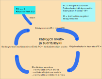

On kerta kaikkiaan nerokasta, kuinka yksinkertaista tietokoneen toiminta on konekäskyjen suorittimen tasolla. Rekisteri PC ilmoittaa seuraavaksi suoritettavan konekäskyn muistiosoitteen. Syklin ensimmäisessä vaiheessa noudamme PC:n osoittaman konekäskyn muistista ja talletamme sen käskyrekisteriin IR. Käytännössä tuo konekäsky löytyy useimmiten välimuistista, mutta se on nyt sivuasia.

Sen jälkeen kasvatamme PC:n arvoa yhdellä, koska oletusarvoisesti seuraavaksi suoritettava konekäsky on aina välittömästi muistissa seuraavana oleva käsky. Tätä seuraavan konekäskyn osoitetta voi vielä (esim.) hyppykäskyn suoritus muuttaa, mutta oletusarvoisesti seuraavaksi suoritetaan nykykäskyn jälkeen muistissa seuraavana oleva käsky.

<!-- kuva: ch-2-2-nouto-suor-sykli-draft   # kalvo 5.3  -->

![Kolme nuolta, jotka kiertävät kehässä toisiaan seuraten. Ylhäällä nuolten välissä on käskyn noutovaihe, jossa käskyrekisteriin IR haetaan muistista paikanlaskurin eli PC:n osoittama käsky. PC:n alkuarvona on nolla, mikä on alustettu syklin ulkopuolella etukäteen. Noutovaihetta seuraa lyhyt nuolen kaari, jonka jälken on ohjelmalaskurin kasvatus eli PC saa arvon PC+1. Sitten on taas lyhyt nuolen kaari, jonka jälkeen IR:ssä olevan käskyn suoritusvaihe. Se voi sisältää muistiviitteitä ja se voi muuttaa PC:n arvoa. Lopulta on pitkä nuolen kaari takaisin käskyn noutovaiheeseen.](./ch-2-2-nouto-suor-sykli.svg)
<div>
<illustrations motive="ch-2-2-nouto-suor-sykli"></illustrations>
</div>

Sitten suoritamme IR:ssä olevan käskyn. Käsky jaetaan ensin eri kenttiin. Näissä kentissä on mm. operaatiokoodi ja niiden rekistereiden numerot, joita käsky käsittelee. Operaatiokoodi voisi olla yhteenlaskukäskyn koodi (17) ja operandeina numerot 3 ja 5 (viitaten rekistereihin R3 ja R5). Kenttien avulla määritellään myös, mihin muistiosoitteeseen käsky mahdollisesti kohdistuu. Yleensä konekäskyissä on korkeintaan yksi muistiviite.

<!-- esimerkki: yksinkertainen konekäsky -->

```
Yksinkertainen konekäsky

ADD  R3, R5  -- kentät: 17 3 0 5 0,
             -- laske R3:n ja R5:n arvot yhteen, talleta tulos R3:een
```

Seuraavaksi käsky suoritetaan sen operaatiokoodin mukaisesti. Jos se on esimerkiksi kertolasku, niin käskyssä annettujen operandien (esim. R3 ja R5) arvot kopioidaan ALU:un, ALU:lle annetaan kertolaskumääräys ja tulos talletetaan käskyssä annettuun rekisteriin (esim. R3). Jos se on hyppykäsky tai ehdollinen haarautumiskäsky, niin mahdollisesti käskyn suorituksessa muutetaankin PC:n arvoa. Jos käskyn suorituksen aikana tapahtuu jokin virhetilanne, niin virhe indikoidaan tilarekisteriin ja käskyn suoritus keskeytetään. Tämä voi tapahtua esimerkiksi jakolaskun yhteydessä, jos suoritusaikana havaitaan jakajan arvon olevan nolla.

Sitten palataan syklissä seuraavan konekäskyn noutoon muistista ja sykli toistuu. Tämä on hämmästyttävän suoraviivaista ja opiskelijoiden on usein vaikea sisäistää, että tässäkö se kaikki on. Tietokone on tosiaankin vain tyhmä kone, joka suorittaa hyvin yksinkertaisia konekäskyjä yksi kerrallaan.


<!-- note: konekäskyjen samanaikainen suoritus -->

<text-box variant="example" name="Konekäskyjen suorituksen optimointi">

Todellisissa tehokkaissa suorittimissa peräkkäisten konekäskyjen suoritusnopeutta on optimoitu useallakin eri menetelmällä, mutta lopputulos on silti samanlainen kuin käskyjen suorittaminen yksi kerrallaan. Tällainen menetelmä on mm. liukuhihnoitus, jossa peräkkäisten konekäskyjen eri vaiheita suoritetaan samanaikaisesti. Esimerkiksi, seuraavaa konekäskyä voidaan olla hakemassa muistista samaan aikaan kuin edellistä vasta suoritetaan. Usein ennakointi kannattaa, mutta joskus tulee huteja. Toinen tapa on tehdä konekäskyistä supertehokkaita, jolloin ne voisivat vaikkapa samalla kertaa useaa laskutoimitusta. Kolmas tapa on toteuttaa suorittimen sisällä monta pienempää suoritinta eli ydintä, joista kukin voi olla suorittamassa omaa ohjelmaansa samanaikaisesti. Neljäs tapa hypersäikeistys mainittiinkin jo aikaisemmin. Siinä suorittimella on esim. kaksi joukkoa rekistereitä, joiden avulla voidaan suorittaa toista ohjelmaa sillä aikaa, kun ensimmäinen odottaa muistiviitteen tekemistä. Näitä kaikki menetelmiä voidaan käyttää yhtä aikaa, mutta ne eivät sisälly tämän kurssin oppimistavoitteisiin.

</text-box>

## Etuoikeutettu suoritustila

Ensimmäiset tietokoneet koetettiin vain saada toimimaan. Pian kuitenkin havaittiin, että suorituksessa oleva ohjelman toimintamahdollisuuksia pitäisi jotenkin rajoittaa, jotta ohjelma ei vahingossa tai tahallaan pääsisi sotkemaan muiden ohjelmien tai käyttöjärjestelmän tietoja. Yksi askel tähän ongelmaan oli muistin suojaus kanta- ja rajarekistereiden (BASE, LIMIT) avulla. Näitä käyttämällä suorituksessa oleva ohjelma ei mitenkään voi viitata kuin omaan muistialueeseensa. Toki rajarekistereiden käyttö myös sallii ohjelman muistialueen sijoittamisen joustavasti mihin päin tahansa keskusmuistia, mikä sinällään on erityisen hyödyllistä.

Kanta- ja rajarekisterit ovat kuitenkin vain rekistereitä ja käyttöjärjestelmän pitää pystyä asettamaan niille uudet arvot. Sitä varten käskykannassa pitää olla konekäskyt BASE ja LIMIT-rekistereiden arvojen muuttamiseen. Ongelmana on nyt, että miten voisimme estää tavallista ohjelmaa käyttämästä noita konekäskyjä. Jos ohjelma voi muuttaa omien kanta- ja rajarekistereidensä arvoja, niin sitä kautta se pääsee käsiksi kaikkeen tietoon muistissa. Ei hyvä!

Ratkaisuna tähän ongelmaan on konekäskyjen jakaminen kahteen luokkaan, tavallisiin ja etuoikeutettuihin (privileged). Etuoikeutetut konekäskyt on varattu käyttöjärjestelmän käyttöön ja tavalliset ohjelmat eivät voi niitä käyttää. Ne ovat olemassa nimenomaan luotettavien käyttöjärjestelmien tekemiseen. Suorittimen _etuoikeutettu suoritustila_-bitti tilarekisterissä SR ilmaisee, että suorituksessa oleva prosessi on nyt etuoikeutetussa tilassa (privileged state, supervisor state) ja saa käyttää näitä etuoikeutettuja konekäskyjä. Jos suoritin on tavallisessa suoritustilassa (user state), niin etuoikeutetun käskyn suoritusyritys aiheuttaa virhetilanteen.

Etuoikeutetussa tilassa prosessi voi muuttaa kanta- ja rajarekistereiden arvoja, ja sitä kautta sillä on pääsy koko muistiin. Voidaan myös ajatella, että etuoikeutettuun tilaan siirtyessään prosessin kanta- ja rajarekistereiden arvot asetetaan koko muistialueen kattavaksi. Muita etuoikeutettuja konekäskyjä ovat mm. välimuistin tyhjennyskäsky ja etuoikeutetusta tilasta paluukäsky.

Nyt ymmärrät, miksi käyttöjärjestelmässä olevat virheet ovat niin vaarallisia. Jos tavallinen ohjelma toimii väärin, se voi sotkea vain oman muistialueensa. Käyttöjärjestelmän palikat voivat sotkea ihan mitä vain, minkä vuoksi niiden ohjelmointi pitää (pitäisi?) tehdä erityisen huolella.

<!-- note: tavallinen käyttäjä vs. ylläpitäjä -->

<text-box variant="example" name="Tavallinen käyttäjä vai ylläpitäjä">

Olisi hyvä, että suorittaisit kotitietokonettasi yleensä tavallisena käyttäjänä etkä ylläpitäjän oikeuksilla. Jos vahingossa päästät haittaohjelman koneellesi, niin ero on merkittävä. Ylläpitäjän oikeuksilla toimiva haittaohjelma on koko ajan etuoikeutetussa tilassa ja saa tehdä ihan mitä haluaa koneellasi.
<br><br>
Prosessien oikeudet määräytyvät sen käynnistävän käyttäjän oikeuksien mukaan. Tavallinen käyttäjän käynnistämät ohjelmat ovat turvallisesti tavallisessa suoritustilassa, kun ylläpitäjän käynnistämät ohjelmat ovat jo heti valmiiksi etuoikeutetussa tilassa suoritettavia.

</text-box>

### Siirtymät etuoikeutetun ja tavallisen suoritustilan välillä
Jotkut (ei kaikki!) käyttöjärjestelmän palvelut suoritetaan aina etuoikeutetussa tilassa. Kun prosessi (suorituksessa oleva ohjelma) kutsuu jotain etuoikeutettua palvelua, käyttöjärjestelmä tarkistaa kutsun yhteydessä onko kyseisellä prosessilla oikeus tehdä näin. Jos kaikki on hyvin, niin suoritus jatkuu etuoikeutetussa tilassa. Jos prosessi yrittää kutsua palvelua, johon sillä ei ole oikeuksia, niin prosessin suoritus päättyy virhetilanteeseen.

Kun etuoikeutetussa tilassa suorittava palvelu päättyy, niin palvelusta paluun yhteydessä suoritustila palaa ennalleen. Tätä varten on yleensä ihan oma (etuoikeutettu) konekäskynsä.

## Virhetilanteet ja keskeytykset

Tietokoneissa tuntuu aina jotain menevän vikaan. Mutta, aivan kuten älykkyydenkin kanssa, nuo käyttäjän havaitsemat virheet tai laitteiston hyytymiset ovat pelkästään ohjelmiston ominaisuuksia. Itse suoritin yksinkertaisine konekäskyineen toimii aina oikein. Sitä käyttävissä ohjelmissa voi kuitenkin olla _vikoja_, jotka voivat suoritusaikana aiheuttaa _virheitä_, jotka taas joskus aiheuttavat _häiriöitä_ käyttäjille tai järjestelmille. Liukuestetarran puuttuminen kylpyammeesta voisi olla vika, joka joskus aiheuttaa liukastumisvirhetilanteen, joka joskus voi aiheuttaa ranteenmurtumishäiriön.

Kaikki suoritusaikaiset mahdolliset virhetilanteet konekäskyjen suorituksessa on ennalta tunnettu ja niihin on varauduttu. Tällainen virhetilanne on esimerkiksi jo aikaisemmin mainittu kokonaislukujen nollalla jako. Sellainen on myös viittaus jonkun muun prosessin tai käyttöjärjestelmän tietoihin, tai yritys suorittaa niiden koodia. Nämä kaikki virhetilanteet ovat virheitä ohjelmistossa ja niiden tyypit ovat kaikki ennalta tunnettuja. Ainoa yllättävä asia niissä on, että emme tiedä etukäteen niiden tapahtumisajankohtaa. Mitään todella yllättäviä virhetilanteita ei kerta kaikkiaan siis voi tapahtua.

Laitteiston virhetilanteet ovat vähän sama kuin että uimahallissa voi joku uimari joutua milloin tahansa hätätilaan. Vaara on tunnistettu, siihen on varauduttu, mutta sen tapahtumisajankohtaa ei tiedetä. Se voi kuitenkin tapahtua ihan millä hetkellä hyvänsä ja tuolloin keskeyttää hallin normaalin toiminnan vähäksi aikaa.

Virhetilanteiden käsittelyn lisäksi samalla tavalla käsitellään kaikki muutkin poikkeustilanteet käskyjen nouto- ja suoritussyklissä. Tällainen poikkeustilanne on vaikkapa Windows-järjestelmissä [CTR-ALT-DEL](https://en.wikipedia.org/wiki/Control-Alt-Delete) näppäimien yhtäaikainen painaminen, mikä avulla halutaan käynnistää nyt just tällä hetkellä jokin tietty käyttöjärjestelmäpalvelu. Sillä hetkellä suorituksessa olevan ohjelman suorituksen täytyy katketa ainakin vähäksi aikaa. Toinen esimerkki mahdollisesta poikkeustilanteesta on I/O-laitekeskeytys, jonka avulla joku ulkoinen laite (esim. kovalevyn laiteohjain) haluaa ilmoittaa käyttöjärjestelmälle, että sille annettu tehtävä on saatu päätökseen. Kolmas esimerkki on käyttöjärjestelmän palvelupyyntökäsky (esim. SVC eli Supervisor Call). Sen toteutus nyt on vain helpointa tehdä poikkeustilanteena, vaikka se muutoin onkin vain tavallinen konekäsky.

Tällaisista virhe- ja poikkeustilanteet käytetään yleisnimeä keskeytys, koska ne kaikki keskeyttävät normaalin käskyjen nouto- ja suoritussyklin, ja siten juuri nyt suorituksessa olevan prosessin suorituksen. Kaikkiin mahdollisiin keskeytyksiin on ennalta varauduttu ja kutakin keskeytystyyppiä varten on olemassa käyttöjärjestelmän oma etuoikeutettu [aliohjelma](https://fi.wikipedia.org/wiki/Aliohjelma), _keskeytyskäsittelijä_. Keskeytystyyppejä ei ole muutamaa kymmentä enempää.

Keskeytyksiä on kolmenlaisia. Meneillään olevan konekäskyn aiheuttamat virhetilanteet käsiteltiin jo. Seuraava ryhmä on järjestelmän omat keskeytykset, joista esimerkkinä on kellolaitekeskeytys. Se voi "pärähtää" päälle esimerkiksi joka 10 ms ja sen avulla käyttöjärjestelmä saa suoritusvuoron järjestelmän ylläpitoon säännöllisin välein. Kolmas ryhmä on perusjärjestelmän ulkopuolelta tulevat keskeytykset. Tällainen on esimerkiksi jo aiemmin mainittu I/O-laitekeskeytys, jonka avulla vaikkapa wifi-verkkosovitin voi ilmoittaa käyttöjärjestelmälle juuri saapuneesta tietoliikennepaketista.

### Keskeytysten käsittely laitteistossa ja käyttöjärjestelmässä
Kaikkiin keskeytyksiin reagoidaan laitteistossa samalla tavalla. Keskeytystä vastaava bitti laitetaan päälle tilarekisterissä ja käskyn aiheuttaman virhetilanteen sattuessa käskyn suoritus lopetetaan. Käskyjen nouto- ja suoritussykliin on laitettu sen loppuun yksi vaihe lisää ja siinä tarkistetaan, että onko tapahtunut jokin keskeytys. Jos keskeytys havaitaan, niin siihen reagoidaan seuraavasti. Ensin talletetaan riittävä määrä tietoa (vähintään PC ja SR) nyt suorituksessa olevasta ohjelmasta, jotta sen suoritus voi mahdollisesti jatkua normaalisti vähän ajan päästä. Seuraavaksi asetetaan PC:n arvoksi keskeytyskäsittelijän alkuosoite. Samalla laitetaan suorittimen etuoikeutettu suoritustila SR:ssä päälle. Keskeytyskäsittelijät ovat tärkeitä osa käyttöjärjestelmää ja ne saavat tehdä ihan mitä vaan. Kaikki tämä tehdään yhdessä humauksessa laitteistotasolla CPU:n kontrolliyksikön ohjaamana.

<!-- kuva: ch-2-2-nouto-suor-kesk-sykli   # kalvo 5.3  -->


<div>
<illustrations motive="ch-2-2-nouto-suor-kesk-sykli"></illustrations>
</div>

Käskyn nouto- ja suoritussykli jatkuu sitten normaalisti, mutta nyt ollaankin jo suorittamassa keskeytyskäsittelijää etuoikeutetussa tilassa. Se tekee tarvittavat toimet ja voi tarvittaessa lopettaa keskeytyneen ohjelman suorituksen. Kun kaikki hallintotoimet on tehty, keskeytyskäsittelijä suorittaa etuoikeutetun keskeytyksestä paluu konekäskyn (esim. IRET eli Interrupt Return). Se palauttaa PC:n ja SR:n arvot ennalleen ja nyt keskeytynyt ohjelma voi jatkaa suoritustaan aivan niin kuin keskeytystä ei olisi koskaan tapahtunutkaan. Jos keskeytetty ohjelma esim. virhetilanteen vuoksi oli lopetettu, niin suoritusvuoro annetaan jollekin toiselle ohjelmalle.

On myös mahdollista, että käyttöjärjestelmän saatua kontrollin (suoritusvuoron suorittimella) keskeytyskäsittelijän kautta se päättääkin antaa suoritusvuoron jollekin toiselle ohjelmalle. Näin voi tapahtua esimerkiksi ns. aikaviipalekeskeytyksen käsittelyssä, kun käyttöjärjestelmä yrittää antaa kaikille järjestelmässä oleville prosesseille reilusti suoritinaikaa, pieninä aikaviipaleina kerrallaan. Suorituksessa oleva ohjelma voi vaihtua minkä tahansa konekäskyn jälkeen, koska keskeytyksiä voi tulla ihan milloin vain. Tämä on erityisen harmillista, koska ohjelman suorituksessa voi olla ajanjaksoja, jolloin tietyn koodinpätkän suoritus pitäisi pystyä tekemään alusta loppuun yhteen menoon. Tilanne on vähän sama kuin että sinä et halua kenenkään keskeyttävän itseäsi juuri kun olet tekemässä maksutapahtumaa verkkopankissa. Se pitää tehdä alusta loppuun oikein. Tämä samanaikaisuudenhallintaongelma on tunnettu ja sitä voi ratkoa erilaisilla menetelmillä käyttöjärjestelmässä. Ihan aina ongelmaa ei ole hoksattu (tai se on korjattu huonosti) ja järjestelmä voi mennä sekaisin ja "hyytyä".


## Käskyjen nouto- ja suoritussyklin toteutus laitteistossa
Käskyn nouto on suoraviivaista. PC:ssä oleva ohjelman oma muistisoite tarkistetaan ja muunnetaan keskusmuistiosoitteeksi MMU:ssa, jonka jälkeen MMU pyytää käskyä muistipiiriltä väylän kautta. Käsky talletetaan käskyrekisteriin IR.

PC:n arvon kasvattaminen yhdellä on niin ikään helppoa. Sitä varten suorittimella voi olla oma yhdellä lisäys -piirinsä, tai sitten arvon kasvatus tehdään ALU:ssa yhteenlaskupiirillä.

```
Esimerkki: Käskyn "ADD R1, R2" nouto ja PC:n kasvatus

Kopioi rekisterin PC arvo rekisteriin MAR.
  (MMU tarkistaa ja muuntaa sen keskusmuistiosoitteeksi)
Anna väylän kontrollirekisterille (Bus Ctl) komento "Read".
Odota hieman.
Kopioi rekisterin MBR arvo käskyrekisteriin IR.
Lisää rekisterin PC arvoa yhdellä.
  (oletettu, että CU:ssa on oma "+1" piiri tätä varten)
```

Kaikkea tätä kontrolloi suorittimen kontrolliyksikkö CU. Jokaisella kellopulssilla se ohjaa kaikkia suorittimen piirejä tekemään halutut toimenpiteet sillä hetkellä. Yhdellä kellopulssilla tehtävät toimet ovat hyvin yksinkertaisia. Vaikka konekäskyt ovat nekin yksinkertaisia, niiden toteutus tapahtuu vielä niitäkin yksinkertaisemmilla komennoilla. Komennot välitetään suorittimen sisällä kontrollijohtimien kautta. Data liikkuu suorittimen sisällä suorittimen sisäistä väylää pitkin.

Käskyn suoritusvaiheessa käsky puretaan ensin osiinsa, jolloin siitä saadaan ulos esimerkiksi tämän käskyn operaatiokoodi ja käskyn käyttämien rekistereiden numerot. Käskyrekisterissä on valmiit johtimet sen eri osien kohdalla, joten käskyn osien esiin saaminen on hyvin helppoa. Tarvittaessa lasketaan operandin muistiosoite ja haetaan operandi muistista MMU:n avulla. Datankin muistisoite pitää tietenkin ensin tarkistaa ja muuttaa keskusmuistiosoitteeksi MMU:ssa. Sitten käskyn operandit ladataan ALU:un ja sinne annetaan käskyssä oleva operaatiokoodi komennoksi. Lopulta ALU-operaation tulos talletetaan käskyssä määriteltyyn rekisteriin tai muistipaikkaan. Jos ALU-operaatiossa tapahtui virheitä, niin ne merkitään tilarekisteriin SR. Samoin vertailu-operaatioiden tulokset talletetaan SR:ään.

```
Esimerkki: Käskyn "ADD R1, R2" suoritusvaihe

Kopioi käskyn ensimmäisen operandin (nyt R1) arvo ALU:n operandiksi 1.
Kopioi käskyn toisen operandin (nyt R2) arvo ALU:n operandiksi 2.
Anna käskyn operaatiokoodi (nyt "add" eli 17) ALU:n komennoksi.
Odota hieman.
Kopioi ALU:n ulostulo ensimmäisen operandin (nyt R1) uudeksi arvoksi
  ja kopioi ALU:n virhetilanteet SR:n vastaaviin bitteihin.
```

Myös keskeytysten tarkistaminen on helppoa. Katsotaan vain, onko jokin keskeytysbitti päällä tilarekisterissä SR. Jos on, niin talletetaan johonkin nykyinen paikanlaskuri PC ja tilarekisteri SR, asetetaan etuoikeutettu tila päälle SR:ssä ja asetetaan PC:n arvoksi kyseiseen keskeytykseen liittyvän keskeytyskäsittelijän alkuosoite.

```
Esimerkki: Keskeytyksen "kokonaisluvun ylivuoto" käsittely

Tarkista keskeytysten olemassaolo SR:stä. O-bitti (overflow) on päällä.
Kopioi PC:n arvo johonkin (esim. pinoon).
Kopio SR:n arvo johonkin (esim. pinoon).
Aseta etuoikeutettu tila (bitti P) päälle SR:ssä
Aseta PC:n arvoksi Kokonaisluvun ylivuoto -keskeytyskäsittelijän osoite
```


<!-- quiz 2.2.1-7 Väitteet käskyjen nouto- ja suoritussyklistä  -->

<div><quiz id="25c50300-f065-41fe-a421-c1247c8dc0c4"></quiz></div>
<div><quiz id="2a1ade70-1acc-4831-9dc2-d74ff86691f0"></quiz></div>
<div><quiz id="26a78b12-f606-4f29-825b-c5aae6f98160"></quiz></div>
<div><quiz id="206d7920-ce65-40b1-9561-a5d34bb643cd"></quiz></div>
<div><quiz id="1b6425b2-ae56-4c4d-b051-8c120fd7969e"></quiz></div>
<div><quiz id="27df69da-fdc7-4eed-8cfe-cbe5b7102758"></quiz></div>
<div><quiz id="1b57385f-ae04-47db-9b1c-8bcff4eb8824"></quiz></div>
