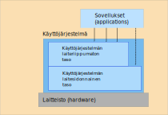

<lead>Käyttöjärjestelmän asema systeemissä on monimutkainen, koska sillä on usea erilainen tehtävä. Se toimii rajapintana laitteistoon ja samalla piilottaa laitteiston yksityiskohdat käyttäjiltä ja sovellusohjelmilta. Se hallinnoi koko järjestelmän resursseja ja jakaa niitä "reilusti" sovellusten käyttöön. Tämän yhteydessä se tarjoaa korkean tason järjestelmäpalveluja sovellusohjelmille, jolloin niiden suunnittelu ja toteutus tulee helpommaksi.</lead>

## Rajapinta laitteistoon
Käyttöjärjestelmän päätehtävä on tehdä erilaisten tietokonejärjestelmien käyttämisestä helppoa, turvallista ja luotettavaa käyttäjille (järjestelmää käyttäville ihmisille) ja järjestelmässä suorittaville ohjelmille. Käyttäjän näkökulmasta käyttöjärjestelmä piilottaa laitteiston yksityiskohdat. Se antaa käyttäjälle yhteisen käyttöliittymän kaikkiin samaa käyttöjärjestelmää käyttäviin järjestelmiin. Ajattele, miten helppoa olisi, jos kaikkien autojen kaikki käyttöliittymät olisivat samoja. Vuokra-autoa käyttöön ottaessa ei tarvitsisi murehtia, mistä lasinpesijä tihkukytkin löytyy tai kuinka vakionopeudensäädin saadaan päälle.

Käyttöjärjestelmä antaa järjestelmässä suorittaville ohjelmille laitteistoriippumattoman käyttöliittymän laitteistoon. Tämä helpottaa huomattavasti sovellusten ohjelmointia, koska ne voidaan suunnitella hyödyntäen käyttöjärjestelmän tehokkaita palveluita. On paljon helpompi suunnitella sovellusohjelma esimerkiksi [Windows](https://fi.wikipedia.org/wiki/Windows)'in tai [Linux](https://fi.wikipedia.org/wiki/Linux)'in "päälle", kun ei erikseen tarvitse murehtia lainkaan, minkä merkkinen kovalevy, tulostin tai verkkokortti järjestelmässä sattuu olemaan. On myös paljon helpompaa lukea tiedostoa _Villen-Peli_ kuin tietyn merkkisen [kovalevyn](https://fi.wikipedia.org/wiki/Kiintolevy) raidan 234 sektoreita 34-36. Normisovelluksen ei edes tarvitse tietää, minne päin kovalevyä hänen tiedostonsa _Villen-Peli_ on tallennettu. Sovelluksen ei tarvitse eikä pidä päästä käsiksi kovalevyn tietoihin tuolla tasolla. Tällöinhän se pystyisi lukemaan kaikki kovalevyllä olevat tiedot, joista osa voi kuulua muille käyttäjille.

Käyttöjärjestelmä koostuu erilaista moduuleista. Osa niistä on aliohjelmina kutsuttavia palveluita ja osa itsenäisinä ohjelmia, jotka ovat suorituksessa aina silloin tällöin tarvittaessa. Näitä palveluohjelmia
([daemon-prosesseja](https://en.wikipedia.org/wiki/Daemon_(computing)),
[daemon lyhyt](https://simple.wikipedia.org/wiki/Daemon_(computer_software)))
käytetään lähettämällä niille palvelupyyntöviestejä ja vastaavasti palvelun valmistuttua niiltä saadaan vastausviesti.

### Käyttöjärjestelmän kaksi tasoa
Usein käyttöjärjestelmässä on kaksi tasoa. Ylempi (laiteriippumaton) taso antaa palveluja tavallisille sovellusohjelmille ja se voi suorittaa koodia tavallisessa käyttäjätilassa. Alempi (laitesidonnainen) taso sisältää kaikki palvelut, jotka käyttävät fyysisiä laitteita. Alemman tason moduulit suoritetaan etuoikeutetussa suoritustilassa ja niitä voi yleensä käyttää (kutsua) vain käyttöjärjestelmän laiteriippumattomalta tasolta. On turvallisempaa, kun käyttöjärjestelmästäkin etuoikeutetussa tilassa suorittaa vain pieni osa koodia. Tätä etuoikeutetussa tilassa suoritettavaa käyttöjärjestelmän osaa kutsutaan usein ([käyttöjärjestelmän ytimeksi](https://fi.wikipedia.org/wiki/K%C3%A4ytt%C3%B6j%C3%A4rjestelm%C3%A4n_ydin)). Siihen sisältyy mm. prosessien luonti ja prosessien välinen viestintä sekä kaikkien fyysisten laitteiden (esim. muisti ja I/O-laitteet) suora hallinta. On helpompaa tehdä turvalliseksi pieni määrä koodia kuin suuri määrä.

<!-- kuva lu08, kalvo 10: ch-4-1-kj-kaksi-tasoa -->

<illustrations motive="ch-4-1-kj-kaksi-tasoa" frombottom="0" totalheight="100%"></illustrations>

## Tehtävät
Rajapintojen lisäksi käyttöjärjestelmällä on muutama tärkeä hallintotehtävä. Se pitää kirjaa kaikista järjestelmässä olevista _resursseista_ (muistitila, levytila, suoritin, jne.) ja antaa niitä suorituksessa olevien ohjelmien ([prosessien](https://fi.wikipedia.org/wiki/Prosessi_(tietotekniikka)), ks. seuraava aliluku) käyttöön reilujen pelisääntöjen mukaisesti. Hallintotehtävät voi karkeasti jakaa prosessien hallintaan, muistin hallintaan, tiedostojen ja laitteiden hallintaan sekä verkkojen hallintaan.

### Prosessien hallinta
Käyttöjärjestelmä huolehtii prosessien vuorottamisesta suorittimella eli päättää, minkä prosessin konekäskyjä suoritin kullakin hetkellä suorittaa. Se ei ole mitenkään helppoa, kun kaikille prosesseille pitää antaa suoritinaikaa "reilusti" ja reiluuden käsite ei tunnetusti ole mitenkään hyvin määritelty. Jotkut prosessit ovat tärkeämpiä kuin toiset ja niille pitää antaa muita enemmän suoritinaikaa. Toisaalta taas joillakin käyttöjärjestelmän moduuleilla voi olla hyvinkin tiukkoja aikarajoja, minkä puitteissa niiden täytyy päästä suoritukseen, jotta järjestelmä ei mene sekaisin.

Käyttöjärjestelmäkin on vain koodia. Sen suoritus ei etene, ellei koodi saa suoritusvuoroa. Esimerkiksi, jos verkon kautta saapuu tietoliikennepaketti, niin käyttöjärjestelmän täytyy pystyä kuittaamaan se lähettäjälle ajoissa tai lähettäjä luulee sen hukkuneen matkalla. Toisaalta myös himopelaaja Ville haluaa, että järjestelmä reagoi nopeasti hänen peliohjaimensa kautta antamiinsa räiskintäpelin komentoihin, jotta hyvin tähdätyt laukaukset ehditään käsitellä ennen kuin vastustaja menee piiloon. Toisin sanoen, myös tavallisilla käyttäjien prosesseilla voi olla aikarajoja prosessien vuoronantoon.

### Muistin hallinta
Jokaiselle prosessille on varattu keskusmuistia jo alkuaankin jokin tietty määrä käyttöönsä, ja prosessit voivat vielä suoritusaikanakin varata lisää tai vapauttaa jo aikaisemmin varattuja muistialueita. Käyttöjärjestelmän pitää kirjaa kunkin prosessin hallussa olevista muistialueista. Se myös tarkkailee koko järjestelmän muistin käyttöä kokonaisuutena. Se yrittää antaa kullekin prosessille tarpeeksi muistitilaa, jotta muistissa olevien prosessin suoritus pystyy etenemään kohtuullisella nopeudella. Jos muistitila tuntuu loppuvan kesken, käyttöjärjestelmä voi siirtää jonkun tai jotkut prosessit "jäähylle" vähäksi aikaa ja vapauttaa niiden käytössä olleen muistitilan muiden käyttöön. Sitten kun muistitilaa on taas paremmin vapaana, jäähyllä olleita prosesseja voi taas ottaa suoritukseen. Uutta prosessia käynnistettäessä järjestelmä tarkistaa aina ensin, onko uudelle prosessille tarpeeksi muistitilaa vapaana. Jos ei ole, niin se joutuu odottamaan muistitilaa jo ennen suorituksensa alkua.

### Tiedostojen hallinta
Tiedostojärjestelmä antaa ohjelmien käyttöön näennäisen helposti käytettävissä olevia tiedostoja. Ne voidaan organisoida hakemistojen avulla ja niiden käyttö tapahtuu tekstipohjaisten _tiedostonimien_ perusteella. On erittäin tehokasta, että ohjelmoijien tai suorituksessa olevien ohjelmien ei tarvitse tietää esimerkiksi, miten suuria tai minkä merkkisiä kovalevyjä järjestelmässä käytetään. Tiedostojärjestelmä tarjoaa sovellusten hakemistot ja yksinkertaiset tiedostot, joita voi helposti lukea ja kirjoittaa.

Tiedostoilla voi olla sisäistä rakennetta tai sitten ne voivat olla puhtaasti sarjallista raakadataa, joko merkkejä jossain merkistössä tai pelkkiä bittejä tavuissa. Hakemistotkin ovat vain tietyn tyyppisiä tiedostoja. Hakemistoilla on oma erikoisrakenteensa, jossa on listattuna kaikki siinä hakemistossa olevien alihakemistojen ja tiedostojen nimet sekä niiden osoitteet tallennuslaitteella. Siellä on myös sopivasti koodattuna pääsyoikeudet kuhunkin tiedostoon. Pääsyoikeuksissa kerrotaan esimerkiksi, että tiedostoa MyStory.docx saa Ville kirjoittaa ja kuka tahansa lukea.

### Laitteiden hallinta
Laitteiden hallinta on yleensä piilotettu erilaisten käyttöjärjestelmäpalikoiden alle piiloon, jolloin käyttäjätason prosessit eivät voi niitä suoraan käyttää. Jokaiselle laitteelle on oma käyttöjärjestelmään kuuluva laiteajurinsa, joka osaa kommunikoida väylän kautta juuri sen laitteen kanssa. Käyttäjätason prosessit kutsuvat aina laiteajuria tekemään varsinaisen työn. Laiteajureissa on usein kaksi osaa. Alemman tason moduuli toteuttaa etuoikeutetussa tilassa kommunikoinnin laitteen kanssa ja on siten täysin räätälöity juuri tuolle laitteelle. Ylemmän tason moduuli voi suorittaa käyttäjätilassa ja se toteuttaa geneerisen käyttöliittymän tälle laitteelle. Täten esimerkiksi eri tyyppisillä kovalevyillä tuo ylemmän tason käyttöliittymämoduuli voi olla sama, mutta niillä on kullakin oma alemman tason moduulinsa.

### Verkon hallinta
Tietoliikenneverkkojen hallinta on hyvin samankaltaista kuin muidenkin laitteiden hallinta. Siihen sisältyy kuitenkin huomattavan paljon ohjelmistoa, jotta verkkojen käyttö olisi helppoa ja samalla eri käyttäjien tiedot olisivat hyvin suojattu. Tämän vuoksi tietoliikenneverkkojen hallinta on yleensä eriytetty omaksi osakseen laitteiden hallinnasta.

Laiteajurit ohjaavat verkkolaitteita, joiden avulla tietokoneet kytketään verkon kautta muihin tietokoneisiin. Varsinaisen tietosiirron toteutus on tehty joko fyysisten kaapeleiden tai langattoman yhteyden avulla. Fyysiseen kaapeliin perustuvista verkkolaitteista yleisin on kuparikaapelia käyttävä on [Eetteriverkko](https://fi.wikipedia.org/wiki/Ethernet) (Ethernet). [Valokuitukaapelia](https://fi.wikipedia.org/wiki/Valokuitu) käyttävä [Gigabit Ethernet](https://fi.wikipedia.org/wiki/Gigabit_Ethernet) on nopeampi, mutta vielä harvemmin käytetty teknologia. Langattomia verkkoja ovat esimerkiksi
[Wi-Fi](https://en.wikipedia.org/wiki/Wi-Fi) ([Wi-Fi lyhyt](https://simple.wikipedia.org/wiki/Wi-Fi))
ja
[Bluetooth](https://fi.wikipedia.org/wiki/Bluetooth) ([Bluetooth lyhyt](https://simple.wikipedia.org/wiki/Bluetooth)).

<!-- note Eetteri. radiosignaali kulkee eetterissä -->

<text-box variant="example" name="Avaruuden eetteri">

Eetteriverkko on saanut nimensä valoa välittävästä 'avaruuden eetteristä', jonka uskottiin olevan välttämätön väliaine valon leviämiselle avaruudessa. Vasta 1887 Michelson ja Morley osoittivat kuuluisalla kokeellaan, että eetteriä ei olekaan olemassa. Sittemmin Einsteinin selitti suhteellisuusteoriallaan, kuinka valo oikeasti kulkee avaruuden tyhjiössä. Vielä nytkin jotkut puhuvat radioaaltojen etenemisestä avaruuden eetterissä &mdash; onhan se ehkä 'helpompi' käsittää ja selittää kuin suhteellisuusteoria, vaikka onkin puppua."

</text-box>

Tietoliikenneverkoissa on tärkeätä, että järjestelmässä suorittavat ohjelmat voivat olla yhteyksissä muiden tietokoneiden (niillä suorittavien ohjelmien) kanssa helposti ja luotettavasti. Helppous näkyy siinä, että yhteydet voidaan luoda muiden koneiden kanssa riippumatta siitä, millä teknologialla verkkoyhteys on toteutettu ja kuinka kaukana maailmalla se toinen tietokone on. Luotettavuus perustuu siihen, että tietoliikennepaketit kulkevat luotettavasti ja että tietoliikennepaketeissa oleva tieto on salakirjoitettua. Tietoliikenneverkkojen käytön toteutus käyttöjärjestelmissä perustuu yhteisesti sovittujen protokollien käyttöön, joita on useammassa kerroksessa. Ylemmän tason kerros on aina toteutettu suoraan sen alla olevan kerroksen palveluja käyttäen.

Ylimmän tason _sovelluskerros_ antaa helposti käytettävän geneerisen käyttöliittymän tietokoneiden (eri tietokoneilla suorittavien prosessien) väliseen yhteydenpitoon. Se myös selvittää, missä verkko-osoitteessa (esim. 128.214.189.90) toisen osapuolen tietokone (esim. "www.helsinki.fi)" sijaitsee. On jälleen hyvin käyttäjäystävällistä, että ympäri maailmaa olevista tietokoneista voidaan käyttää niiden _nimiä_ ja käyttöjärjestelmä sitten selvittää niiden _osoitteen_ nimen perusteella. Sovelluskerros pyytää _kuljetuskerrosta_ siirtämään halutun tiedon (tietosegmentin) vastaanottajalle. Sen alapuolella oleva _verkkokerros_ pilkkoo tiedon saman kokoisiksi paketeiksi ja selvittää parhaimman reitin vastaanottajalle. _Linkkikerros_ siirtää paketit (esim. Eetteriverkko-protokollaa käyttäen) verkon välittäjien kautta vastaanottajalle ja varmistaa, että ne menevät perille. Varsinaisen bittien siirron tekee alimman tason _fyysinen kerros_, joka on toteutettu puhtaasti laitteistolla.

<!-- Quizes 4.1.1-3 -->

<quiz id="1d74391d-bb77-4dad-a002-969e7c91a67e"></quiz>

<quiz id="1d214fb7-b968-423e-ba75-94f68026281a"></quiz>

<quiz id="30a3d7aa-1ef5-452a-8746-f8bb10ce5b2d"></quiz>

