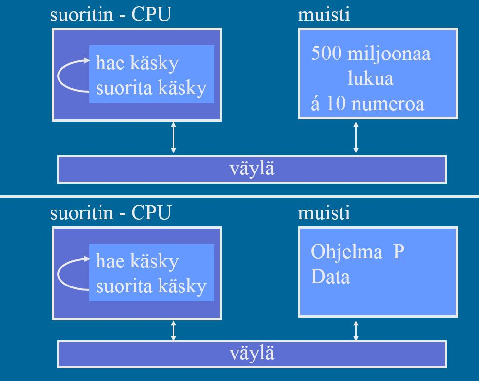
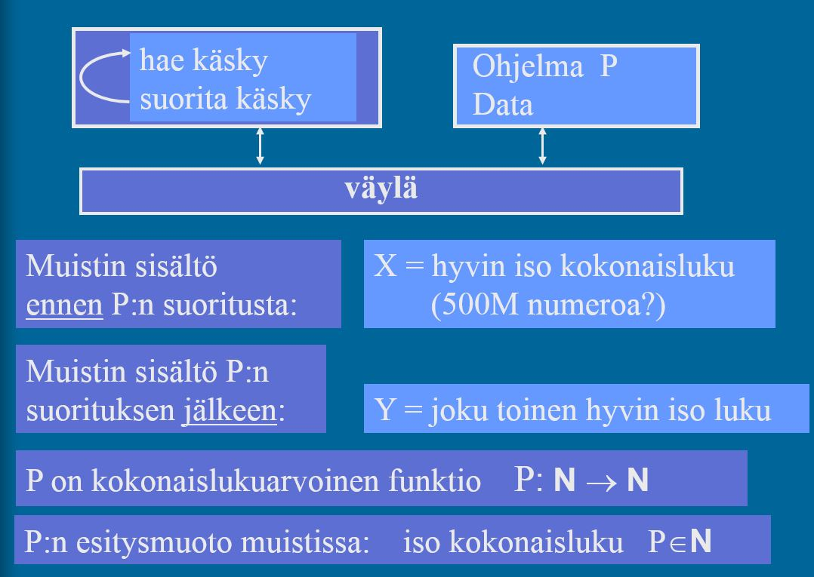

<lead>Tässä viimeisessä osioissa koostamme yhteen aikaisemmin oppimaamme ja näytämme, kuinka kokonaislukulaskentaa voidaan käyttää pohjana tietokoneella ratkaistavissa olevien ohjelmien määrittämiseen.
</lead>

## Laskennan rajat
Tietokonejärjestelmämme perusmuodossaan on hyvin yksinkertainen. Siellä on suoritin, joka suorittaa muistissa olevan ohjelman P konekäskyjä yksi kerrallaan. Muistissa on suoritettavien käskyjen lisäksi myös ohjelman käyttämä data. Muistin koko voisi olla vaikkapa 200 MB tai 2 GB, jolloin siinä voi olla esimerkiksi 50 miljoonaa tai 500 miljoonaa 32-bittistä kokonaislukua. Muisti ja suoritin on liitetty toisinsa väylällä, vaikka sillä yksityiskohdalla ei tässä yhteydessä olekaan merkitystä.

-- kuva luento 12, slide 32   ch-4-4-lask-teoria-perusta-draft.jpg

<illustrations motive="ch-4-4-lask-teoria-perusta-draft" frombottom="0" totalheight="100%"></illustrations>

Tarkastelkaamme nyt tuota muistin sisältöä hieman tarkemmin. Esimerkiksi 500 miljoonan kokonaisluvun kirjoittaminen ei ole kovinkaan käytännöllistä, joten käytämme matematiikasta tuttuja merkintöjä. merkitään muistin sisltöä ennen ohjelman P suoritusta luvulla X. X on hyvin suuri luku, jossa voisi olla miljardeja numeroita. Sillä ei kuitenkaan ole mitään väliä, koska symbolin 'X' kirjoittaminen on helppoa.

Oletetaan nyt, että ohjelma P suoritetaan ja suoritus päättyy normaalisti. Ohjelmakoodi muistissa on edelleen sama, mutta toivottavasti ohjelma P on tehnyt jotain ja muuttanut jotain dataa. Koko muistin sisältöä merkitään nyt Y:llä. Myös Y:ssä voi olla miljardeja numeroita, mutta ei se mitään. Sillä, että P saattaisi tulostaa jotain tulostimella tai kirjoittaa jotain kovalevylle, ei tässä yhteydessä ole mitään merkitystä. Jos halutaan, niin voimme ottaa Y:n mukaan kaikki tulostimen kirjoittamat merkit ja kaikki kovalevyllä oleva tieto. Se ei tässä yhteydessä ole kuitenkaanvaikuta mihinkään.

Sekä X että Y on muodostettu siis laittamalla kaikki keskusmuistin tavut peräkkäin ja muodostamalla näin hyvin suuria kokonaislukuja. Ainoana erona X:llä ja Y:llä on, että niiden välissä on suoritettu ohjelma P. Voimme ajatella, että P on funktio, joka on kuvannut kokonaisluvun X kokonaisluvuksi Y. Toisin sanoen, mielivaltaisesti valittu ohjelma P on itse asiassa kokonaislukujen välinen funktio. tarkemmin ajatellen myös P on itse kokonaisluku. P:n arvo saadaan, kun otamme muistista P:n ohjelmakoodin (tai latausmoduulin?) kaikki tavut ja laitamme ne peräkkäin suureksi kokonaisluvuksi.

-- kuva luento 12, slide 33   ch-4-4-lask-teoria-kokon-luvut-draft.jpg

<illustrations motive="ch-4-4-lask-teoria-kokon-luvut-draft" frombottom="0" totalheight="100%"></illustrations>

[Laskennan teoria](https://fi.wikipedia.org/wiki/Laskennan_teoria) perustuu oivallukseen, että mielivaltaisten ohjelmien ominaisuuksia voidaan päätellä kokonaislukujen ja niiden välisten funktioiden ominaisuuksista. Tämä ei kuulosta mitenkään kovin mullistavalta, mutta sen avulla on pystytty todistamaan merkittäviä ohjelmien ominaisuuksia, jotka pätevät kaikille tietokoneille nyt ja tulevaisuudessa. Se on paljon sanottu!

Voidaan esimerkiksi todistaa, että olipa meillä mikä tahansa tietokoneen muistin koko tai mikä tahansa aikaraja, niin aina on olemassa jokin ratkaistavissa oleva ongelma, jonka ratkaisu vie joko liikaa aikaa tai vaatii liikaa muistitilaa. Emme siis koskaan tule keksimään tietokonetta, joka olisi riittävän nopea ja suuri kaikki ratkaistavissa oleviin ongelmiin.

Voimme myös todistaa, että on olemassa ongelmia, joita ei voi ratkaista millään tietokoneella. On tavallaan lohdullista tietää, aina löytyy ongelmia, joita kone ei osaa ratkaista.

Ongelmia voidaan myös luokitella. Suuri joukko tunnettuja optimointiongelmia ovat sellaisia, että emme oikeastaan vielä tiedä kuinka vaikeita ne ovat. Jos johonkin niistä löytyy joskus hyvä ratkaisu, niin sitten löytyy niihin muihinkin. Mutta toistaiseksi ratkaisua ei ole löytynyt. Mutta toisaalta ei ole löytynyt todistustakaan siitä, että tuollaista hyvää ratkaisua ei voisi löytää. Jos työantajasi pyytää sinulta ratkaisua vähän vaiampaan ongelmaan, voi olla noloa sanoa kahden viikon työrupeaman jälkeen, että "en minä osaa". Jos kyseessä on joku variantti noista tunnetuista optimointiongelmista, on paljon mukavampi pystyä sanomaan, että "en minä osaa, mutta ei osaa kukaan muukaan koko maailmassa!".

### Yhteenveto
Neljäs luku esitteli käyttöjärjestelmien perusasiat. Esittelimme ensin käyttöjärjestelmän tehtävätalueet. Sitten tutustuimme prosessin käsitteeseen. Kaikki laskenta järjestelmässä tapahtuu prosessien kautta ja kukin prosessi ovat suoritettavien ohjelmien esitysmuotoja järjestelmässä. Sitten näytimme, kuinka käyttöjärjestelmä voidaan toteuttaa eri tavoin kutsuttavien aliohjelmien ja prosessien avulla. Lopuksi esittelimme kuinka tietokonejärjestelmien laskentakyvyn rajoja voidaan päätellä tämän kurssin antamien tietojen avulla.

Vastaa alla olevaan kyselyyn, kun olet valmis tämän luvun tehtävien kanssa.

<quiznator id="5c6d60a214524713f95a4f28"></quiznator>

<!--

  <part-summary chapter="4" heading="Tämän viimeisen luvun 4 jälkeen sinun pitäisi pystyä selittämään:" listitems='[
  {"content":"Mitkä ovat käyttöjärjestelmän päätehtävät? "},
  {"content":"Kuinka käyttöjärjestelmä toimii käyttöliittymänä laitteistoon?"},
  {"content":"Minkälaisia resursseja käyttöjärjestelmä hallinnoi?"},
  {"content":"Minkälaisia palveluja käyttöjärjestelmä antaa sovelluksille?"},
  {"content":"Mikä on prosessi ja sen esitysmuoto järjestelmässä?"},
  {"content":"Miten prosessin vaihto tapahtuu?"},
  {"content":"Mikä on prosessin kuvaaja ja suoritinympäristö?"},
  {"content":"Mitkä ovat prosessin tilat?"},
  {"content":"Miten käyttöjärjestelmä on toteutettu pääpiirteissään?"},
  {"content":"Mitkä ovat käyttöjärjestelmän hallintotehtävien viisi pääluokkaa?"},
  {"content":"Miten käyttöjärjestelmän palveluja käytetään?"},
  {"content":"Miten kokonaislukujen väliset funktiot liittyvät laskettavuusteoriaan?"}
    ]'>
  </part-summary>

-->

## Mitä seuraavaksi???

Katso mooc.fi

Ohjelmointia

Tietokoneen toiminta

Tietokoneen rakenne

Käyttöjärjestelmät
